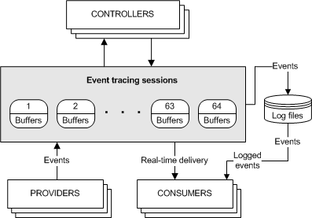
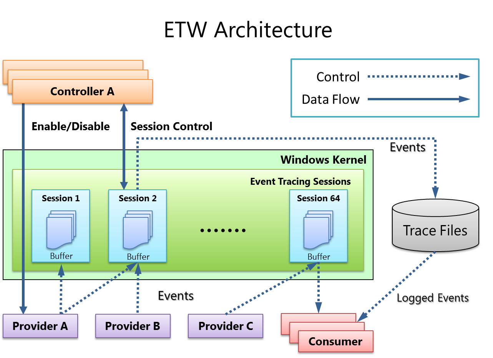

A few years ago I wrote a [C++ wrapper for the Event Tracing for Windows (ETW) library](https://github.com/LucasWilsonGit/CPUBench). At the time there were no existing open source C++ wrappers for this API, and I wanted to be able to collect hardware performance counters without having to install a test-signed kernel driver.

At the time, the API for implementing ETW Controllers and ETW Consumers was poorly documented, and quite non-intuitive. I found working with ETW to be extremely frustrating. Wondering whether it was just me, I was quite pleased to find that reputable developers had also had a bad experience with this library. There is a [Casey Muratori article on ETW which I referenced when writing my first implementation](https://web.archive.org/web/20250506052608/https://caseymuratori.com/blog_0025) which shows his near-contempt for the design of the API. 

 
    <h2 style="margin-bottom: 0;"> Revisiting ETW </h2>
    <h5 style="margin-top: 0;"> Why I decided to rewrite my library </h5>

After writing my library, I used it quite infrequently, the experience was still inferior to using Googlebench for microbenchmarking, and what I had written had none of the profiling capabilities of perf. It was easier to just work in a WSL2 environment to do performance analysis, or use the Windows Performance Analyzer tool. 

One of the largest problems with the library was only being able benchmark a single thread of execution. 

When I set about fixing that problem, I found myself faced with a problem many developers are familiar with; Reading my old code - I hated it. This was a bit frustrating initially, but after I while I've decided to look at it positively. It shows that I'm growing as a developer and learning things that make my old work seem inferior. 

The truth is that my first time around, I really didn't understand ETW very well at all. Given the quite severe lack of community, documentation and open source code around ETW, I thought I'd write down as much as I could that I've learned rewriting my library. If only for my own future reference. 

There were a few things I wanted to do "properly" this time around: 

- The original implementation had an include to windows.h upfront. This meant pulling in a *lot* of very large header files to use what would otherwise be a fairly small library.
- It was very tightly coupled to ETW, meaning that if I wanted to make my library cross-platform at a later date, I would have to rewrite it from scratch anyway. 
- I did not fully understand the different kinds of TRACE_HANDLEs that controllers/consumers used, nor what states a trace could have it's enabled performance counters changed. This meant I was restarting the trace significantly more often than I needed to.
- Technical debt in the old code was making it hard to work with, and I had done a very poor job of documenting my work to give myself any reference with which to return to the project 3 years later.
- My new design would use Dependency Inversion to try to abstract away as much of the platform-specific code to a separate template unit as possible. 
- I would separate orchestrating the trace from the benchmarking controls as much as possible. 
- The Dependency Inversion could also be leveraged to make testing my new solution simpler, and having better tests will make future development work easier by catching regressions.
- I would use CMake for my build system rather than Visual Studio solutions. Admittedly, I'm still using MSVC to compile, but at least this way I could compile on MinGW if I wanted to.

    

        
Feature

        
Old Implementation

        
New Design

        
Header Dependency

        
<i class="fa-solid fa-xmark" style="color: #d33;"></i> Includes <code>windows.h</code>, pulling in many large headers

        
<i class="fa-solid fa-check" style="color: #3c3;"></i> No <code>windows.h</code>; minimal and clean includes

        
Platform Coupling

        
<i class="fa-solid fa-xmark" style="color: #d33;"></i> Tightly bound to ETW, Windows-only

        
<i class="fa-solid fa-check" style="color: #3c3;"></i> Abstracted backend with potential for cross-platform

        
Trace Control Logic

        
<i class="fa-solid fa-xmark" style="color: #d33;"></i> Restarts trace unnecessarily due to misuse of ETW handles

        
<i class="fa-solid fa-check" style="color: #3c3;"></i> Optimized trace control, fewer restarts

        
Maintainability

        
<i class="fa-solid fa-xmark" style="color: #d33;"></i> Undocumented and hard to revisit

        
<i class="fa-solid fa-check" style="color: #3c3;"></i> Clean design, better structure and docs

        
Design Principles

        
<i class="fa-solid fa-xmark" style="color: #d33;"></i> Monolithic, mixed responsibilities

        
<i class="fa-solid fa-check" style="color: #3c3;"></i> Separation of concerns, dependency inversion

        
Testability

        
<i class="fa-solid fa-xmark" style="color: #d33;"></i> Not test-friendly

        
<i class="fa-solid fa-check" style="color: #3c3;"></i> Mockable backends, unit testable

        
Build System

        
<i class="fa-solid fa-xmark" style="color: #d33;"></i> Visual Studio solutions only

        
<i class="fa-solid fa-check" style="color: #3c3;"></i> CMake, supports MSVC and MinGW

        
Event Loss Handling

        
<i class="fa-solid fa-xmark" style="color: #d33;"></i> Loses events by discarding too early

        
<i class="fa-solid fa-check" style="color: #3c3;"></i> Correctly handles ETW buffers, fewer losses

    

 
    <h2 style="margin-bottom: 0;"> Decoupling Platform Specific Details </h2>
    <h5 style="margin-top: 0;"> Improved Portability + Testability </h5>

 
    <h2 style="margin-bottom: 0;"> Better Trace Controller Implementation </h2>
    <h5 style="margin-top: 0;"> What I've learned about ETW. </h5>

 
    <h2 style="margin-bottom: 0;"> Cross Platform Build System </h2>
    <h5 style="margin-top: 0;"> Or at least, something which can become one. </h5>

 
    <h2 style="margin-bottom: 0;"> Future Work </h2>
    <h5 style="margin-top: 0;"> What's next for my library? </h5>

<h4> Proper Event Timestamping </h4>

ETW buffers events internally until they are consumed. My old implementation was pretty easy to end up causing bluescreens with depending on which counters were activated, and how slow the consumer was. These events may be buffered for a while before a consumer pulls them. 

Here is a  microsoft documentation picture that somewhat fails to intuitively convey this detail, but can help understand the idea:

Here is an even funnier version of the same picture, where they've labelled their lines incorrectly. The background of the image is also transparent, so [on a dark page the text becomes almost invisible in the learn.microsoft page it comes from.](https://web.archive.org/web/20240314001907/https://learn.microsoft.com/en-us/windows-hardware/test/weg/instrumenting-your-code-with-etw)

I previously supported "pausing" benchmarks, where consumed events would be discarded if an atomic bool was set. This did not consider the timestamp within the events.

I would like to have a lower event loss rate by properly dealing with the timestamps in events. Instead of immediately discarding events as soon as I "pause" tracing, I should consider the timestamp I paused at, and selectively discard only events which the producer emitted after I entered the paused state. 

<h4> An extra layer of buffering </h4> 

I'd like to move the counter tracking out of the platform specific code, and have my cross-platform code have it's own buffer of events which would be "de-platformed" but still have critical information. Instead of uint32_t profile_source, I'd have a counter_type counter which would be meaningful even if the source id changed (Highly unlikely). This may potentially give me room to do "remote" tracing in the future.

I'm always going to be a realtime consumer of the performance counter ETW events, but I would like to be able to also serialize them into a custom format. This would also be reusable for "remote" tracing. I could then write them into a file, and this may enable averaging results across multiple executions, or comparing results before/after changes for some kind of CI/CD rejection of bad updates which might harm cache-locality etc. 

<h4> Symbol Resolution </h4>

Since ETW events give us the instruction pointer when the counter overflow occurred, if I can get this to resolve against debug symbols in the binary, I could actually include that information in some kind of per-file histogram where overflows are bucketed by line number, or by the enclosing function. This would be a move towards equivalent functionality with perf.  

<h4> Support other events </h4>

The usecase everyone else generally has for writing a realtime ETW consumer is collecting stack traces on context switches. I'd also like to be able to get events for memory page faults and syscalls. 